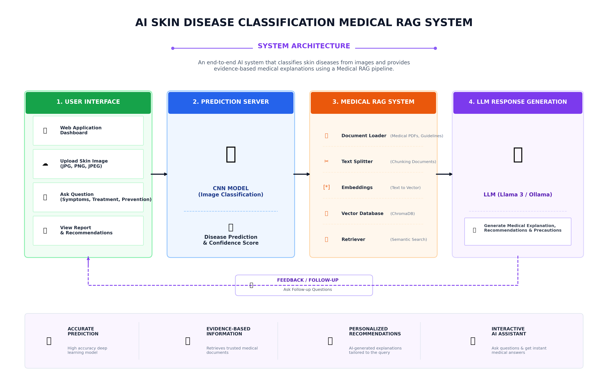
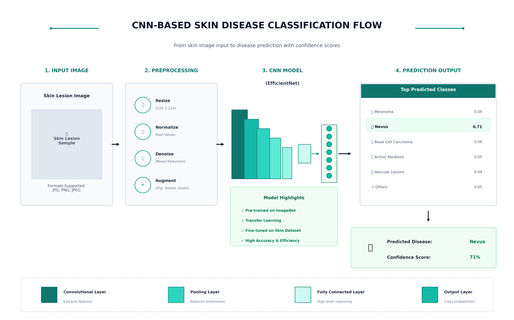

# AI Skin Disease Classification & Medical RAG System

An end-to-end Flask-based AI application that classifies skin disease images using EfficientNet (TensorFlow) and provides grounded medical guidance using RAG (Retrieval-Augmented Generation).

```
Dataset Link - https://www.kaggle.com/datasets/kmader/skin-cancer-mnist-ham10000 (HAM10000 Dataset)
```

```
Model Link - https://github.com/likhita-devji/AI-Skin-Disease-Classification-Medical-RAG-System
```

## 🔹 System Architecture
The application utilizes a modular AI pipeline:
- **Vision Pipeline**: Processes image uploads through a TensorFlow CNN (EfficientNetB0) to identify 7 specific skin disease classes.
- **RAG Pipeline**: Uses LangChain and ChromaDB to retrieve context from trusted medical PDFs.
- **Inference Engine**: Generates safe, non-hallucinated responses via a local Ollama LLM.



## 🔹 CNN Based Skin Disease Classification


---

## 🔹 Technology Stack

| Layer | Technology | Role |
| :--- | :--- | :--- |
| **Backend** | Flask | API Orchestration & Routing |
| **ML Model** | TensorFlow | CNN-based Image Classification (EfficientNetB0) |
| **RAG Framework** | LangChain | Knowledge Retrieval Logic |
| **Vector DB** | Chroma | Semantic Search & Embeddings |
| **Containerization** | Docker | Environment Isolation & Portability |
| **LLM** | Ollama | Local Inference (LlamaMedicine) |

---

## 🔹 Supported Skin Disease Classes
- Actinic_Keratoses (akiec)
- Basal_Cell_Carcinoma (bcc)
- Benign_Keratosis (bkl)
- Dermatofibroma (df)
- Melanoma (mel)
- Melanocytic_Nevi (nv)
- Vascular_Lesions (vasc)

---

## 🔹 Project Structure
```
.
├── app.py                         # Main Flask Backend
├── Dockerfile                     # Container Configuration
├── skin_disease_classifier.keras  # Trained CNN Model
├── class_names.json               # Skin Disease Label Mapping
├── download_dataset.py            # Dataset Downloader Utility
├── requirements.txt               # Dependencies
├── models/
│   ├── classifier.py              # CNN Model Inference Engine
│   └── train_model.py             # EfficientNet Training Script
├── rag/
│   ├── vector_store.py            # ChromaDB Vector Store (PDF & MD)
│   └── rag_engine.py              # RAG Query & LLM Engine
├── medical_knowledge_db/          # Trusted Medical PDFs & Reference Guides
│   ├── skin_diseases_medical_guide.pdf
│   ├── melanoma.md
│   ├── basal_cell_carcinoma.md
│   └── ...
├── chroma_db/                     # Persistent Vector Store
├── uploads/                       # User Uploaded Images
├── templates/                     # Frontend UI (Jinja2)
└── static/                        # CSS, JS, and Infographic Assets
    ├── css/style.css
    ├── js/main.js
    └── images/
        ├── system_architecture_infographic.png
        └── classification_flow_infographic.png
```

---

## 🔹 Deployment (Docker)
This project is containerized for production-ready consistency. It uses a Hybrid Architecture where the application logic is isolated in Docker while connecting to the host machine's LLM service.

To Build:
```bash
docker build -t skin-rag-app .
```

To Run:
```bash
docker run -d --name skinapp \
  -p 5001:5000 \
  -e OLLAMA_BASE_URL="http://host.docker.internal:11434" \
  -v "$(pwd)/medical_knowledge_db:/app/medical_knowledge_db" \
  -v "$(pwd)/chroma_db:/app/chroma_db" \
  -v "$(pwd)/uploads:/app/uploads" \
  skin-rag-app
```

---

## 🔹 Technical Implementation Details:
- **Networking**: `host.docker.internal` allows the containerized Flask app to communicate with the Ollama service running on the host OS.
- **Volumes**: Persistent storage is mounted for the `medical_knowledge_db` and `chroma_db` to ensure search indices remain intact during restarts.
- **Environment Variables**: The `OLLAMA_BASE_URL` allows for flexible LLM endpoint configuration without modifying code.

---

## 🔹 Key Technical Highlights for Interviews
- **RAG over Plain LLM**: Prevents medical hallucinations by forcing the model to answer based only on provided medical literature.
- **Edge Privacy**: By using Ollama, the system performs local inference, ensuring sensitive medical data never leaves the local environment.
- **Model Optimization**: The CNN handles spatial feature extraction (texture/edges), while the RAG pipeline handles semantic knowledge retrieval.
- **DevOps Readiness**: Full Dockerization ensures the "it works on my machine" problem is eliminated, providing a clean path to cloud deployment.
